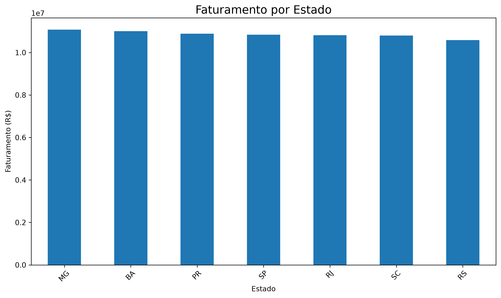
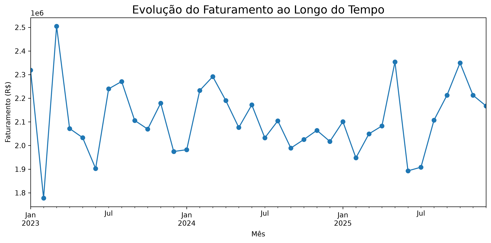
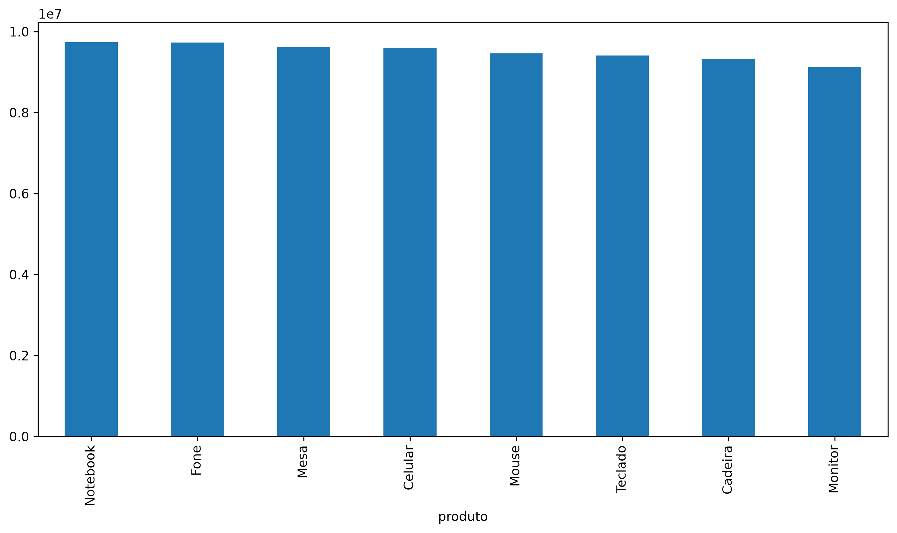
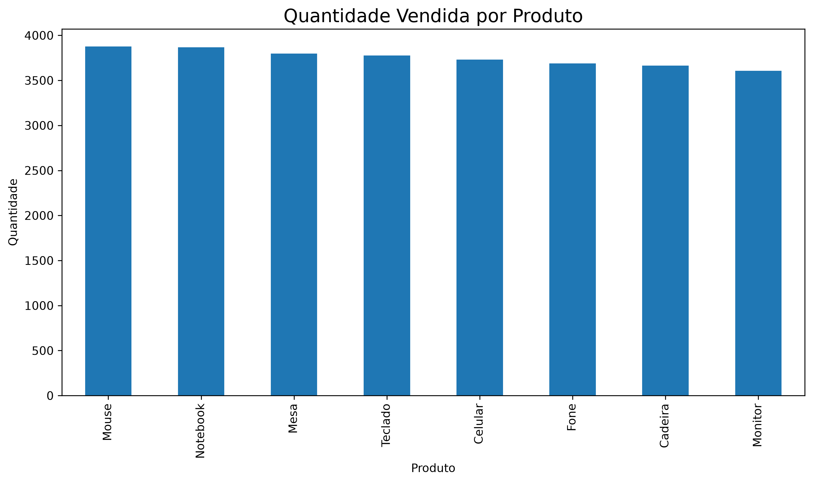

<div align="center">

# 📊 Análise de Vendas de E-commerce

### Do dado bruto à decisão de negócio: Python, Pandas e SQL aplicados a uma operação de e-commerce

Projeto completo de Análise de Dados que simula a rotina de um Analista de Dados — da geração dos dados ao armazenamento estruturado, consultas SQL e geração de insights.

<br/>

[](https://www.python.org/)
[](https://pandas.pydata.org/)
[](#)
[](https://www.sqlite.org/)
[](https://jupyter.org/)
[](https://git-scm.com/)
[](LICENSE)

[](#)
[](#)
[](#)
[](#)

<br/>

[📖 Sobre](#-sobre-o-projeto) •
[🏗️ Arquitetura](#️-arquitetura-do-projeto) •
[🗂️ Dataset](#️-dataset) •
[🖼️ Demonstração](#️-demonstração) •
[⚙️ Funcionalidades](#️-funcionalidades) •
[🛠️ Tecnologias](#️-tecnologias) •
[🚀 Como Executar](#-como-executar) •
[🗄️ Camada SQL](#️-camada-sql) •
[📈 Análises](#-análises-realizadas) •
[💡 Insights](#-principais-insights) •
[👨‍💻 Autor](#-autor)

</div>

<br/>

---

## 📖 Sobre o Projeto

Este projeto foi desenvolvido para praticar, de ponta a ponta, o ciclo de trabalho de um **Analista de Dados** aplicado a um cenário de e-commerce — não apenas manipulando dados em Python, mas também estruturando-os em um banco de dados e utilizando **SQL** para extrair análises, como acontece em ambientes corporativos reais.

### 🎯 Objetivo

Simular a rotina completa de análise de dados de uma operação de e-commerce: gerar os dados, tratá-los, armazená-los de forma estruturada em um banco **SQLite**, consultá-los via **SQL** e traduzir os resultados em insights de negócio, apoiados por visualizações.

### 💼 Problema de Negócio

Antes de qualquer decisão comercial — como priorizar um produto, reforçar estoque ou direcionar investimento para uma região — é preciso entender o que os dados de vendas mostram. Este projeto simula esse processo, respondendo a perguntas que fazem parte da rotina de qualquer time comercial ou de dados em um e-commerce:

- 🏆 Quais produtos geram maior receita?
- 🗺️ Quais estados possuem maior faturamento?
- 📈 Como as vendas evoluem ao longo do tempo?
- 📦 Quais produtos possuem maior demanda?

### 💡 Motivação

Como parte da minha formação em Análise e Desenvolvimento de Sistemas, este projeto foi construído para consolidar o ciclo completo de um projeto de dados — geração, tratamento, armazenamento, consulta, análise e comunicação de resultados — reproduzindo, em menor escala, o fluxo de trabalho de um Analista de Dados dentro de uma empresa.

<br/>

---

## 🏗️ Arquitetura do Projeto

<div align="center">

```
Dataset CSV
     ↓
Python + Pandas  (limpeza e tratamento)
     ↓
SQLite Database  (armazenamento estruturado)
     ↓
SQL Queries  (consultas analíticas)
     ↓
Análise Exploratória
     ↓
Visualizações
     ↓
Insights de Negócio
```

</div>

Essa arquitetura reproduz, em menor escala, um fluxo comum em times de dados: os dados brutos são tratados em Python, persistidos em um banco relacional e, a partir daí, consultados via SQL para alimentar as análises e visualizações finais.

<br/>

---

## 🗂️ Dataset

O dataset utilizado neste projeto é **sintético**, gerado via script Python (`scripts/gerar_dados.py`), e foi construído para simular uma operação real de e-commerce, contendo informações de vendas por cliente, produto, categoria, estado e período.

| Coluna | Descrição |
|---|---|
| `data` | Data em que a venda foi realizada |
| `cliente_id` | Identificador único do cliente |
| `produto` | Nome do produto vendido |
| `categoria` | Categoria à qual o produto pertence |
| `estado` | Estado (UF) onde a venda foi realizada |
| `quantidade` | Quantidade de unidades vendidas na transação |
| `preco` | Preço unitário do produto |
| `faturamento` | Valor total gerado pela venda (quantidade × preço) |

Após o tratamento em Pandas, os dados são persistidos em um banco **SQLite** (`database/vendas.db`), o que permite consultá-los via SQL da mesma forma que se faria em um ambiente analítico corporativo.

<br/>

---

## 🖼️ Demonstração

<div align="center">

### 💰 Faturamento por Estado


<br/><br/>

### 📅 Evolução Mensal do Faturamento


<br/><br/>

### 🏆 Faturamento por Produto


<br/><br/>

### 📦 Quantidade Vendida por Produto


</div>

> 💬 Todas as imagens acima são geradas automaticamente ao executar o notebook e salvas na pasta `images/`.

<br/>

---

## ⚙️ Funcionalidades

- 🧪 **Geração de dados** — criação de um dataset sintético de vendas de e-commerce
- 🧹 **Limpeza e tratamento** — tratamento de valores nulos, duplicados e inconsistências
- 🗄️ **Criação do banco SQLite** — estruturação dos dados em um banco relacional
- 🔍 **Consultas SQL** — extração de métricas diretamente via SQL
- 🔎 **Análise exploratória (EDA)** — exploração inicial e entendimento da base
- 📐 **Métricas de negócio** — faturamento total, ticket médio, ranking de estados e produtos
- 📊 **Visualizações** — gráficos gerados com Matplotlib
- 💡 **Geração de insights** — leitura analítica dos resultados obtidos

<br/>

---

## 🛠️ Tecnologias

| Tecnologia | Utilização |
|---|---|
|  | Manipulação de dados e automação do fluxo de análise |
|  | Tratamento, limpeza e transformação dos dados |
|  | Armazenamento estruturado dos dados de vendas |
|  | Consultas analíticas e extração de métricas de negócio |
|  | Criação das visualizações |
|  | Exploração interativa dos dados |
|  | Controle de versão |
|  | Hospedagem e documentação do projeto |

<br/>

---

## 📁 Estrutura do Projeto

```
analise-vendas-ecommerce/
│
├── data/
│   └── vendas.csv                       # Dataset de vendas em formato CSV
│
├── database/
│   └── vendas.db                        # Banco SQLite com os dados estruturados
│
├── images/
│   ├── faturamento_estado.png           # Gráfico: faturamento por estado
│   ├── faturamento_mensal.png           # Gráfico: evolução mensal do faturamento
│   ├── faturamento_produto.png          # Gráfico: faturamento por produto
│   └── quantidade_produto.png           # Gráfico: quantidade vendida por produto
│
├── notebooks/
│   └── analise_vendas.ipynb             # Notebook principal com toda a análise
│
├── scripts/
│   ├── gerar_dados.py                   # Geração do dataset sintético
│   ├── criar_banco.py                   # Criação e carga do banco SQLite
│   ├── executar_sql.py                  # Execução das consultas exploratórias
│   └── executar_analises_negocio.py     # Execução das análises de negócio
│
├── sql/
│   ├── consultas_vendas.sql             # Consultas exploratórias em SQL
│   └── analises_negocio.sql             # Consultas de métricas de negócio
│
├── requirements.txt                     # Dependências do projeto
├── README.md                            # Documentação do projeto
└── .gitignore                           # Arquivos e pastas ignorados pelo Git
```

- **`data/`** — armazena o dataset bruto em CSV
- **`database/`** — armazena o banco SQLite gerado a partir dos dados tratados
- **`images/`** — armazena os gráficos gerados automaticamente pelo notebook
- **`notebooks/`** — contém o notebook com todo o processo de análise, documentado passo a passo
- **`scripts/`** — scripts responsáveis por gerar os dados, criar o banco e executar as análises
- **`sql/`** — consultas SQL utilizadas nas análises exploratórias e de negócio

<br/>

---

## 🚀 Como Executar

### ✅ Pré-requisitos

- [Python 3.10+](https://www.python.org/downloads/)
- [Git](https://git-scm.com/)

### 1️⃣ Clonar o projeto

```bash
git clone https://github.com/ederfelixsilva/analise-vendas-ecommerce.git
```

### 2️⃣ Entrar na pasta do projeto

```bash
cd analise-vendas-ecommerce
```

### 3️⃣ Criar ambiente virtual

**Windows:**
```bash
python -m venv venv
venv\Scripts\activate
```

**Linux/Mac:**
```bash
python3 -m venv venv
source venv/bin/activate
```

### 4️⃣ Instalar dependências

```bash
pip install -r requirements.txt
```

### 5️⃣ Gerar o dataset

```bash
python scripts/gerar_dados.py
```

### 6️⃣ Criar o banco de dados

```bash
python scripts/criar_banco.py
```

### 7️⃣ Executar as consultas SQL

```bash
python scripts/executar_sql.py
python scripts/executar_analises_negocio.py
```

### 8️⃣ Executar a análise no notebook

```bash
jupyter notebook notebooks/analise_vendas.ipynb
```

> 💡 Ao executar todas as células do notebook, os gráficos serão gerados e salvos automaticamente na pasta `images/`.

<br/>

---

## 🗄️ Camada SQL

Além da análise em Python, o projeto conta com uma **camada SQL** dedicada, simulando o tipo de consulta analítica realizada em ambientes corporativos, com os dados já estruturados no banco `database/vendas.db`.

### 🔍 Consultas Exploratórias (`consultas_vendas.sql`)

- Faturamento por produto
- Faturamento por estado
- Produtos mais vendidos
- Evolução mensal das vendas

### 📐 Análises de Negócio (`analises_negocio.sql`)

- Faturamento total
- Ticket médio
- Quantidade total vendida
- Ranking de estados por faturamento
- Identificação de produtos estratégicos

Essa separação entre consultas exploratórias e consultas de negócio reflete uma prática comum em times de dados: primeiro entender o comportamento geral da base, para depois extrair métricas voltadas à tomada de decisão.

<br/>

---

## 📈 Análises Realizadas

### 💰 Faturamento por Produto

Consolida a receita gerada por cada produto do catálogo, permitindo identificar quais itens têm maior peso no faturamento total — informação relevante para decisões como priorização de vitrine, campanhas e negociação com fornecedores.

### 🗺️ Faturamento por Estado

Analisa a distribuição geográfica das vendas, ajudando a identificar em quais estados a operação já é mais forte e onde podem existir oportunidades de expansão comercial ou ações de marketing regional.

### 📅 Evolução Temporal

Observa o comportamento do faturamento mês a mês, permitindo identificar tendências de crescimento, possíveis quedas e padrões relevantes para o planejamento comercial.

### 📦 Quantidade Vendida por Produto

Analisa o volume de unidades vendidas por produto, trazendo a perspectiva de demanda. Combinada à análise de faturamento, apoia decisões relacionadas a estoque e planejamento de compras.

<br/>

---

## 💡 Principais Insights

> Leitura dos resultados no formato de uma apresentação executiva, como seria levada a um time de negócio:

- 🏆 **Concentração de receita** — parte do catálogo tende a concentrar a maior fatia do faturamento total, reforçando a importância de priorizar esses produtos em ações comerciais e de estoque.
- 🗺️ **Oportunidades regionais** — o faturamento não se distribui de forma homogênea entre os estados, o que pode indicar tanto mercados já consolidados quanto regiões com potencial de crescimento ainda pouco explorado.
- 📈 **Comportamento temporal** — a evolução mensal do faturamento permite observar se o negócio está em trajetória de crescimento, estabilidade ou retração, e se existem meses que se destacam.
- 📦 **Volume x Receita** — produtos com maior volume de vendas não são necessariamente os que mais faturam, reforçando a necessidade de olhar quantidade e receita em conjunto ao definir prioridades.

<br/>

---

## 🔮 Melhorias Futuras

- [ ] 📊 **Dashboard Power BI** — transformar as análises em um painel interativo
- [ ] 🖥️ **Dashboard Streamlit** — criar uma aplicação web interativa em Python
- [ ] 📈 **Plotly/Dash** — construir visualizações dinâmicas e interativas
- [ ] 🐘 **PostgreSQL** — migrar o armazenamento para um banco relacional mais robusto
- [ ] 🏛️ **Data Warehouse** — estruturar uma modelagem dimensional para os dados
- [ ] 🔄 **ETL** — automatizar a extração, transformação e carga dos dados
- [ ] 🤖 **Machine Learning** — aplicar modelos preditivos sobre os dados de vendas
- [ ] 🔮 **Forecasting** — prever tendências futuras de faturamento
- [ ] ☁️ **Cloud Deploy** — publicar a análise ou dashboard em um serviço de nuvem
- [ ] 🧪 **Testes automatizados** — adicionar testes para as etapas de tratamento e carga de dados

<br/>

---

## 🎓 Aprendizados

Durante o desenvolvimento deste projeto, os principais pontos de evolução foram:

- Aprofundamento em **Python** aplicado à análise de dados
- Manipulação e transformação de dados com **Pandas**
- Modelagem e estruturação de dados em **SQLite**
- Escrita de consultas analíticas em **SQL**
- Condução de uma **análise exploratória (EDA)** de forma estruturada
- Criação de **visualizações** claras e objetivas com Matplotlib
- Desenvolvimento do raciocínio analítico necessário para transformar dados em possíveis decisões de negócio
- Fortalecimento da **comunicação de insights** para públicos não técnicos

<br/>

---

## 👨‍💻 Autor

<div align="center">

### Éder Félix Silva

Estudante de Análise e Desenvolvimento de Sistemas

📊 Data Analytics &nbsp;•&nbsp; 🐍 Python &nbsp;•&nbsp; 🗄️ SQL &nbsp;•&nbsp; ☁️ Cloud Computing

[](https://www.linkedin.com/in/eder-f%C3%A9lix/)
[](https://github.com/ederfelixsilva)

</div>

<br/>

---

<div align="center">

**⭐ Se este projeto foi útil ou interessante, considere deixar uma estrela no repositório.**

</div>
